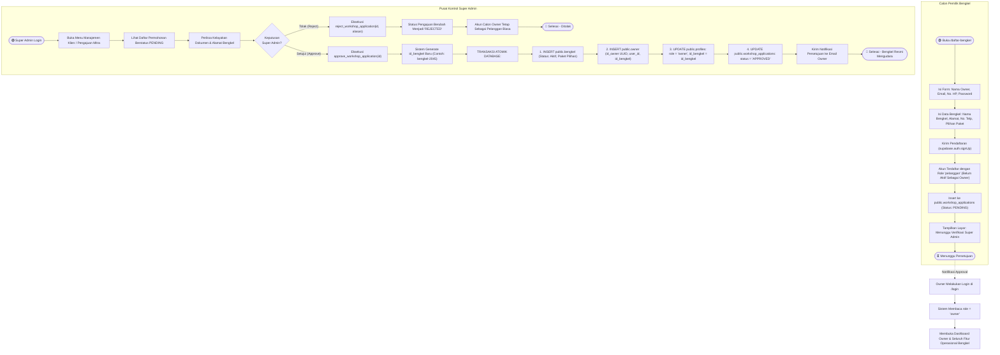
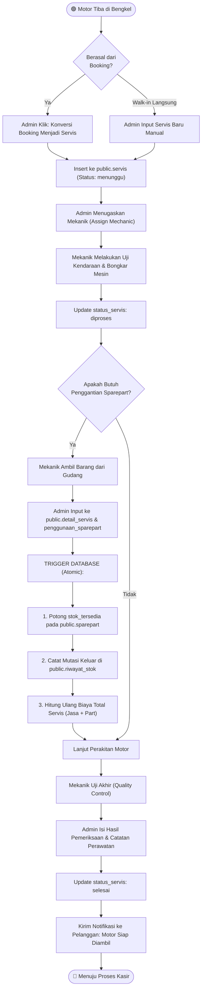
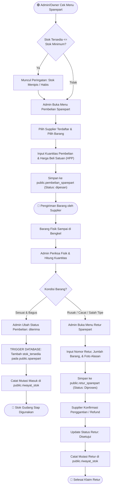
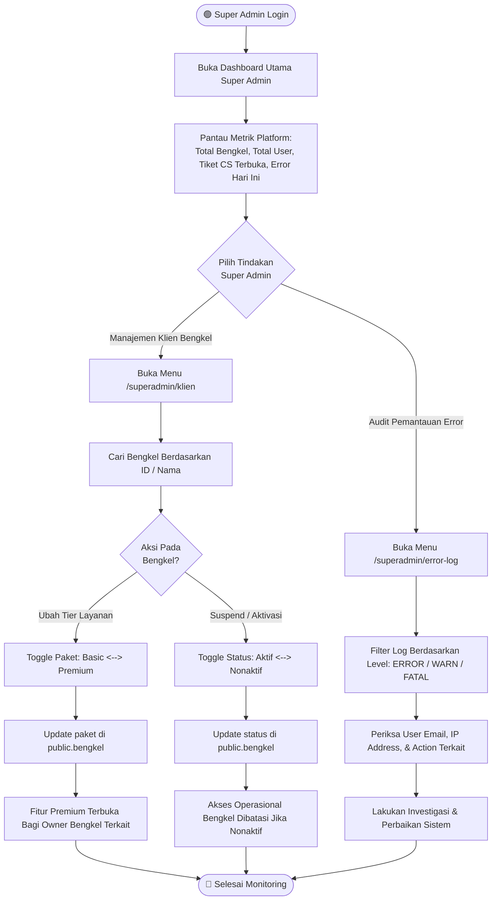

# 📊 APPBENK — DOKUMENTASI ERD & BPMN TERBARU

> **Versi:** September 2026  
> **Database:** PostgreSQL (Supabase Cloud Live)  
> **Jangkar Multi-Tenant:** `public.bengkel` (`id_bengkel` TEXT)  
> **Status Integrasi:** Phase 1 & Phase 2 Operasional + Modul RBAC & Onboarding Terpadu  

---

## 📑 DAFTAR ISI
1. [Entity Relationship Diagram (ERD) Lengkap](#1-entity-relationship-diagram-erd-lengkap)
2. [Kamus Data & Struktur Tabel Operasional](#2-kamus-data--struktur-tabel-operasional)
3. [BPMN 1: Registrasi & Login Multirole (Zero-Trust & Brute Force Lockout)](#bpmn-1-registrasi--login-multirole)
4. [BPMN 2: Onboarding Calon Owner Bengkel & Review Super Admin](#bpmn-2-onboarding-calon-owner-bengkel--review-super-admin)
5. [BPMN 3: Undangan & Aktivasi Staf Admin oleh Owner](#bpmn-3-undangan--aktivasi-staf-admin-oleh-owner)
6. [BPMN 4: Booking Servis Kendaraan Bermotor](#bpmn-4-booking-servis-kendaraan-bermotor)
7. [BPMN 5: Operasional Pengerjaan Servis & Penggunaan Sparepart](#bpmn-5-operasional-pengerjaan-servis--penggunaan-sparepart)
8. [BPMN 6: Pembayaran, Kasir & Verifikasi QRIS / Transfer](#bpmn-6-pembayaran-kasir--verifikasi-qris--transfer)
9. [BPMN 7: Pengadaan Stok, Pembelian, & Retur Sparepart](#bpmn-7-pengadaan-stok-pembelian--retur-sparepart)
10. [BPMN 8: Layanan Tiket Customer Service Terpusat](#bpmn-8-layanan-tiket-customer-service-terpusat)
11. [BPMN 9: Monitoring Platform & Manajemen Klien Super Admin](#bpmn-9-monitoring-platform--manajemen-klien-super-admin)

---

## 1. ENTITY RELATIONSHIP DIAGRAM (ERD) LENGKAP

Berikut adalah diagram relasi entitas (*ERD*) resmi yang mencerminkan database live AppBenk, menghubungkan modul autentikasi, entitas bengkel terpusat, operasional harian bengkel, hingga modul onboarding:

```mermaid
erDiagram
    AUTH_USERS ||--|| PROFILES : "1-to-1 auth identity"
    AUTH_USERS ||--o| OWNER : "akun owner"
    AUTH_USERS ||--o| ADMIN : "akun admin"
    AUTH_USERS ||--o| PELANGGAN : "akun pelanggan (opsional)"

    BENGKEL ||--o| OWNER : "dimiliki oleh (1-to-1)"
    BENGKEL ||--o{ ADMIN : "mempekerjakan (1-to-N)"
    BENGKEL ||--o{ MEKANIK : "memiliki teknisi"
    BENGKEL ||--o{ SUPPLIER : "mitra pemasok"
    BENGKEL ||--o{ BOOKING_SERVIS : "menerima reservasi"
    BENGKEL ||--o{ SERVIS : "pelaksanaan servis"
    BENGKEL ||--o{ PEMBELIAN_SPAREPART : "pengadaan stok"
    BENGKEL ||--o{ RETUR_SPAREPART : "pengembalian barang"
    BENGKEL ||--o{ WORKSHOP_PAYMENT_ACCOUNTS : "rekening & QRIS"
    BENGKEL ||--o{ CUSTOMER_SERVICE_TICKETS : "tiket CS bengkel"
    BENGKEL ||--o{ ADMIN_INVITATIONS : "antrean undangan staf"

    PELANGGAN ||--o{ KENDARAAN : "memiliki motor"
    PELANGGAN ||--o{ BOOKING_SERVIS : "membuat booking"
    PELANGGAN ||--o{ SERVIS : "menerima servis"
    PELANGGAN ||--o{ PEMBAYARAN : "membayar tagihan"
    PELANGGAN ||--o{ CUSTOMER_SERVICE_TICKETS : "mengajukan tiket CS"

    KENDARAAN ||--o{ BOOKING_SERVIS : "objek servis"
    KENDARAAN ||--o{ SERVIS : "objek pengerjaan"

    BOOKING_SERVIS ||--o| SERVIS : "dikonversi menjadi"

    SERVIS ||--o{ DETAIL_SERVIS : "rincian biaya & part"
    SERVIS ||--o{ PENGGUNAAN_SPAREPART : "pemakaian sparepart"
    SERVIS ||--o| PEMBAYARAN : "faktur tagihan"

    SPAREPART ||--o{ DETAIL_SERVIS : "direferensikan"
    SPAREPART ||--o{ PENGGUNAAN_SPAREPART : "dikurangkan dari stok"
    SPAREPART ||--o{ PEMBELIAN_SPAREPART : "ditambahkan ke stok"
    SPAREPART ||--o{ RIWAYAT_STOK : "audit log mutasi"
    SPAREPART ||--o{ RETUR_SPAREPART : "barang diretur"

    SUPPLIER ||--o{ PEMBELIAN_SPAREPART : "menyediakan part"
    SUPPLIER ||--o{ RETUR_SPAREPART : "tujuan retur"

    CUSTOMER_SERVICE_TICKETS ||--o{ CUSTOMER_SERVICE_MESSAGES : "riwayat percakapan"

    AUTH_USERS ||--o{ WORKSHOP_APPLICATIONS : "pengajuan buka bengkel"
    BENGKEL ||--o| WORKSHOP_APPLICATIONS : "hasil approval"

    AUTH_USERS ||--o{ SYSTEM_LOGS : "jejak audit platform"

    PROFILES {
        uuid id PK "references auth.users(id)"
        text full_name "nama lengkap"
        text email "email unik @gmail.com"
        text phone "nomor handphone"
        text gender "Laki-laki / Perempuan"
        text avatar_url "foto profil"
        app_role role "pelanggan | admin | owner | super_admin"
        text id_bengkel FK "relasi ke public.bengkel(id_bengkel)"
        timestamptz created_at
        timestamptz updated_at
    }

    BENGKEL {
        text id_bengkel PK "contoh: bengkel-001, bengkel-002"
        text nama_bengkel "nama resmi bengkel"
        text alamat "lokasi bengkel"
        text no_telepon "kontak resmi"
        text paket "Basic | Premium"
        text status "Aktif | Nonaktif"
        text owner_nama "nama pemilik"
        text owner_email "email pemilik"
        timestamptz created_at
        timestamptz updated_at
    }

    OWNER {
        uuid id_owner PK "gen_random_uuid()"
        uuid user_id UK "references auth.users(id)"
        text id_bengkel FK "references public.bengkel(id_bengkel)"
        text nama "nama owner"
        text email UK "email owner"
        text no_hp "telepon owner"
        text status "aktif | nonaktif"
        timestamptz created_at
        timestamptz updated_at
    }

    ADMIN {
        uuid id_admin PK "gen_random_uuid()"
        uuid user_id UK "references auth.users(id)"
        text id_bengkel FK "references public.bengkel(id_bengkel)"
        text nama "nama staf admin"
        text email UK "email staf"
        text no_hp "telepon staf"
        text status "aktif | nonaktif"
        timestamptz created_at
        timestamptz updated_at
    }

    PELANGGAN {
        text id_pelanggan PK "contoh: pl-001, pl-002"
        uuid user_id FK "references auth.users(id) - nullable"
        text nama "nama pelanggan"
        text email UK "email pelanggan"
        text no_hp "whatsapp pelanggan"
        text alamat "alamat domisili"
        timestamptz created_at
        timestamptz updated_at
    }

    KENDARAAN {
        uuid id_kendaraan PK "gen_random_uuid()"
        text id_pelanggan FK "references pelanggan(id_pelanggan)"
        text merk "Honda / Yamaha / Suzuki / Kawasaki"
        text tipe "Vario 160 / NMAX / Beat / dll"
        int tahun "tahun pembuatan"
        text nopol "plat nomor polisi"
        int kilometer "kilometer odometer terakhir"
        timestamptz created_at
        timestamptz updated_at
    }

    MEKANIK {
        text id_mekanik PK "contoh: mk-001"
        text id_bengkel FK "references bengkel(id_bengkel)"
        text nama_mekanik "nama teknisi"
        text no_telepon "kontak teknisi"
        text spesialisasi "Mesin / Kelistrikan / CVT / Suspensi"
        text status "Aktif | Nonaktif"
        timestamptz created_at
        timestamptz updated_at
    }

    BOOKING_SERVIS {
        uuid id_booking PK "gen_random_uuid()"
        text nomor_booking UK "contoh: BK-2026-0001"
        text id_bengkel FK "references bengkel(id_bengkel)"
        text id_pelanggan FK "references pelanggan(id_pelanggan)"
        uuid id_kendaraan FK "references kendaraan(id_kendaraan)"
        text id_mekanik FK "opsional pilihan pelanggan"
        date tanggal_booking "tanggal jadwal servis"
        time waktu_booking "jam kedatangan"
        text jenis_servis "Servis Ringan / CVT / Tune Up"
        text keluhan "masalah pada motor"
        text status_booking "menunggu_konfirmasi | disetujui | ditolak"
        text alasan_penolakan "alasan jika ditolak"
        timestamptz created_at
        timestamptz updated_at
    }

    SERVIS {
        uuid id_servis PK "gen_random_uuid()"
        text nomor_servis UK "contoh: SRV-2026-0001"
        text id_bengkel FK "references bengkel(id_bengkel)"
        uuid id_booking FK "relasi ke booking (nullable)"
        text id_pelanggan FK "references pelanggan(id_pelanggan)"
        uuid id_kendaraan FK "references kendaraan(id_kendaraan)"
        text id_mekanik FK "teknisi yang menangani"
        text mekanik "nama teknisi"
        text jenis_servis "tipe servis"
        text keluhan "keluhan awal"
        text pekerjaan "tindakan perbaikan"
        text hasil_pemeriksaan "analisis motor"
        numeric biaya_jasa "biaya jasa kerja"
        numeric biaya_sparepart "total sparepart terpakai"
        numeric total_biaya "total tagihan"
        text status_servis "menunggu | diproses | selesai | lunas"
        date tanggal_servis "tanggal pelaksanaan"
        timestamptz tanggal_selesai "waktu penyerahan motor"
        text catatan "catatan teknis"
        timestamptz created_at
        timestamptz updated_at
    }

    DETAIL_SERVIS {
        uuid id_detail PK "gen_random_uuid()"
        uuid id_servis FK "references servis(id_servis)"
        text id_sparepart FK "references sparepart(id_sparepart)"
        int jumlah "kuantitas suku cadang"
        numeric harga "harga satuan"
        numeric subtotal "jumlah * harga"
        text keterangan "spesifikasi part"
        timestamptz created_at
    }

    SPAREPART {
        text id_sparepart PK "contoh: sp-001, sp-002"
        text kode "kode sku misal SP-001"
        text nama_sparepart "nama barang"
        text kategori "Oli / Pengereman / CVT / Kelistrikan"
        text satuan "Botol / Pcs / Set"
        numeric harga "harga jual konsumen"
        int stok_tersedia "stok fisik bengkel"
        int stok_minimum "peringatan stok menipis"
        text status_stok "tersedia | menipis | habis"
        timestamptz tanggal_update
        timestamptz created_at
        timestamptz updated_at
    }

    PENGGUNAAN_SPAREPART {
        uuid id_penggunaan_sparepart PK "gen_random_uuid()"
        text id_sparepart FK "references sparepart(id_sparepart)"
        uuid id_servis FK "references servis(id_servis)"
        date tanggal "tanggal pemasangan"
        int jumlah "kuantitas part"
        numeric total_harga "total nilai part"
        text mekanik "teknisi pemasang"
        text keterangan "catatan pemakaian"
        timestamptz created_at
    }

    SUPPLIER {
        text id_supplier PK "contoh: sup-001"
        text id_bengkel FK "references bengkel(id_bengkel)"
        text nama "nama distributor / toko"
        text kontak "person in charge"
        text telepon "telepon supplier"
        text alamat "lokasi gudang supplier"
        timestamptz created_at
    }

    PEMBELIAN_SPAREPART {
        uuid id_pembelian_sparepart PK "gen_random_uuid()"
        text nomor_pembelian "nomor faktur pembelian"
        text id_bengkel FK "references bengkel(id_bengkel)"
        text id_supplier FK "references supplier(id_supplier)"
        text id_sparepart FK "references sparepart(id_sparepart)"
        date tanggal "tanggal order"
        int jumlah "jumlah barang dibeli"
        numeric harga "harga beli satuan (HPP)"
        numeric total "total pembayaran ke supplier"
        text status "dipesan | diterima | dibatalkan"
        timestamptz created_at
    }

    RIWAYAT_STOK {
        uuid id_riwayat_stok PK "gen_random_uuid()"
        text id_sparepart FK "references sparepart(id_sparepart)"
        text tipe "masuk | keluar | penyesuaian"
        text jenis "pembelian | servis | retur | opname"
        int qty "kuantitas mutasi"
        date tanggal "tanggal mutasi"
        text keterangan "deskripsi mutasi stok"
        timestamptz created_at
    }

    RETUR_SPAREPART {
        uuid id_retur_sparepart PK "gen_random_uuid()"
        text nomor_retur UK "contoh: RET-2026-001"
        text id_bengkel FK "references bengkel(id_bengkel)"
        text id_supplier FK "references supplier(id_supplier)"
        uuid id_pembelian_sparepart FK "faktur pembelian asal"
        text id_sparepart FK "references sparepart(id_sparepart)"
        int jumlah "jumlah barang diretur"
        numeric harga_satuan "harga retur satuan"
        numeric total_nilai "total nilai retur"
        date tanggal "tanggal pengembalian"
        text alasan "kemasan rusak / cacat produksi"
        text status "Disetujui | Diproses | Ditolak"
        bool stok_dikurangi "status sinkronisasi stok"
        timestamptz created_at
        timestamptz updated_at
    }

    PEMBAYARAN {
        uuid id_pembayaran PK "gen_random_uuid()"
        text nomor_transaksi UK "contoh: TRX-2026-0001"
        uuid id_servis FK "references servis(id_servis)"
        text id_pelanggan FK "references pelanggan(id_pelanggan)"
        text id_bengkel FK "references bengkel(id_bengkel)"
        text metode "Tunai | Transfer Bank | QRIS"
        text metode_pembayaran "cash | transfer | qris"
        date tanggal_bayar "tanggal transaksi"
        numeric total_bayar "total tagihan"
        numeric jumlah_bayar "nominal diterima"
        text status "Lunas | Menunggu Verifikasi | Ditolak"
        text status_pembayaran "lunas | pending | rejected"
        text bukti_url "url bukti transfer (supabase storage)"
        text alasan_penolakan "alasan bukti tidak valid"
        timestamptz created_at
        timestamptz updated_at
    }

    WORKSHOP_PAYMENT_ACCOUNTS {
        uuid id PK "gen_random_uuid()"
        text id_bengkel FK "references bengkel(id_bengkel)"
        text account_type "qris | bank_transfer"
        text provider "MANUAL | MIDTRANS"
        text provider_account_id "id akun pembayaran"
        text bank_name "BCA / Mandiri / BNI / BRI"
        text account_number "nomor rekening"
        text account_holder_name "nama pemilik rekening"
        text qr_image_url "gambar barcode qris static"
        text display_name "nama tampilan kasir"
        bool is_active "status aktif"
        text status "active | inactive"
        timestamptz created_at
        timestamptz updated_at
    }

    CUSTOMER_SERVICE_TICKETS {
        uuid id PK "gen_random_uuid()"
        text ticket_number UK "contoh: CS-0001 (dari sequence)"
        text bengkel_id FK "references bengkel(id_bengkel)"
        uuid user_id FK "pembuat tiket (auth.uid)"
        app_role user_role "role pembuat tiket"
        text user_name "nama pembuat (otomatis dari profiles)"
        text user_email "email pembuat"
        text subject "judul kendala"
        text description "rincian pengaduan"
        text category "Teknis / Billing / Fitur / Umum"
        text priority "Rendah / Sedang / Tinggi / Mendesak"
        text status "Buka | Diproses | Menunggu Klien | Selesai | Ditutup"
        timestamptz created_at
        timestamptz updated_at
    }

    CUSTOMER_SERVICE_MESSAGES {
        uuid id PK "gen_random_uuid()"
        uuid ticket_id FK "references customer_service_tickets(id)"
        uuid sender_user_id FK "pengirim chat (auth.uid)"
        app_role sender_role "role pengirim"
        text sender_name "nama pengirim"
        text message "isi pesan chat"
        text attachment_url "lampiran dokumen/foto"
        timestamptz created_at
    }

    SYSTEM_LOGS {
        uuid id PK "gen_random_uuid()"
        text level "INFO | WARN | ERROR | FATAL"
        text action "LOGIN | REGISTER | APPROVE | TRANSACTION"
        text resource "auth / billing / service / workshop"
        text message "pesan aktivitas / stack trace"
        uuid user_id FK "user terkait"
        text user_email "email user"
        text user_role "role user"
        text ip_address "alamat ip klien"
        jsonb details "payload audit tambahan"
        timestamptz created_at
    }

    WORKSHOP_APPLICATIONS {
        uuid id PK "gen_random_uuid()"
        uuid user_id FK "calon owner (auth.users)"
        text nama_bengkel "nama pengajuan bengkel"
        text alamat "alamat pengajuan"
        text no_telepon "telepon bengkel"
        text owner_nama "nama lengkap owner"
        text owner_email "email resmi owner"
        text paket "Basic | Premium"
        text status "PENDING | APPROVED | REJECTED"
        text catatan_review "catatan dari super admin"
        uuid reviewed_by FK "super admin yang memverifikasi"
        timestamptz reviewed_at "waktu keputusan"
        text bengkel_id_result FK "id_bengkel yang terbentuk"
        timestamptz created_at
        timestamptz updated_at
    }

    ADMIN_INVITATIONS {
        uuid id PK "gen_random_uuid()"
        text id_bengkel FK "references bengkel(id_bengkel)"
        text email "email calon staf admin"
        text nama "nama calon staf"
        text token UK "token unik kriptografis 48 jam"
        uuid created_by FK "owner pengundang (auth.uid)"
        timestamptz expires_at "batas waktu aktivasi (48 jam)"
        text status "pending | accepted | expired | cancelled"
        uuid accepted_by FK "user yang mengklaim"
        timestamptz accepted_at "waktu aktivasi berhasil"
        timestamptz created_at
        timestamptz updated_at
    }
```

---

## 2. KAMUS DATA & STRUKTUR TABEL OPERASIONAL

| Entitas / Tabel | Kategori Modul | Tipe Kunci Utama | Kolom Penghubung Multi-Tenant | Deskripsi Fungsional |
| :--- | :--- | :--- | :--- | :--- |
| `public.profiles` | Core Autentikasi | `id` (UUID) | `id_bengkel` (TEXT, Nullable) | Profil pengguna terpadu untuk semua peran (`app_role`). |
| `public.bengkel` | Core Multi-Tenant | `id_bengkel` (TEXT) | `id_bengkel` (Primary) | Master mitra bengkel motor AppBenk (paket Basic/Premium). |
| `public.owner` | Core Hak Akses | `id_owner` (UUID) | `id_bengkel` (TEXT) | Data verifikasi pemilik bengkel (relasi 1 Owner : 1 Bengkel). |
| `public.admin` | Core Hak Akses | `id_admin` (UUID) | `id_bengkel` (TEXT) | Data staf operasional bengkel (relasi 1 Bengkel : N Admin). |
| `public.pelanggan` | Master Data | `id_pelanggan` (TEXT) | Terhubung saat booking | Master data pelanggan motor, riwayat servis, & domisili. |
| `public.kendaraan` | Master Data | `id_kendaraan` (UUID)| Terikat via pelanggan | Master kendaraan motor (merk, tipe, tahun, nomor polisi). |
| `public.mekanik` | Operasional Bengkel| `id_mekanik` (TEXT) | `id_bengkel` (TEXT) | Master mekanik/teknisi bengkel beserta keahlian khusus. |
| `public.booking_servis`| Transaksi Servis | `id_booking` (UUID) | `id_bengkel` (TEXT) | Antrean reservasi jadwal servis masuk dari pelanggan. |
| `public.servis` | Transaksi Servis | `id_servis` (UUID) | `id_bengkel` (TEXT) | Surat perintah kerja & rekam medis pengerjaan fisik motor. |
| `public.detail_servis` | Transaksi Servis | `id_detail` (UUID) | Terikat via `id_servis` | Rincian suku cadang dan jasa per transaksi pengerjaan. |
| `public.sparepart` | Inventaris & Gudang| `id_sparepart` (TEXT) | Master Global/Bengkel | Katalog sparepart, batas stok minimum, dan harga jual. |
| `public.penggunaan_sparepart` | Inventaris | `id_penggunaan_sparepart` (UUID) | Terikat via `id_servis` | Log pemotongan fisik suku cadang oleh mekanik servis. |
| `public.supplier` | Logistik & Pengadaan | `id_supplier` (TEXT) | `id_bengkel` (TEXT) | Mitra distributor penyedia oli dan suku cadang motor. |
| `public.pembelian_sparepart` | Logistik | `id_pembelian_sparepart` (UUID) | `id_bengkel` (TEXT) | Surat pesanan pembelian barang masuk dari supplier. |
| `public.riwayat_stok` | Inventaris & Audit | `id_riwayat_stok` (UUID) | Terikat via `id_sparepart` | Catatan kartu stok (masuk, keluar, retur, selisih opname). |
| `public.retur_sparepart` | Logistik & Klaim | `id_retur_sparepart` (UUID) | `id_bengkel` (TEXT) | Pengembalian barang cacat/rusak ke pihak supplier. |
| `public.pembayaran` | Kasir & Keuangan | `id_pembayaran` (UUID)| `id_bengkel` (TEXT) | Faktur penerimaan uang (Cash, Transfer Bank, QRIS). |
| `public.workshop_payment_accounts` | Kasir | `id` (UUID) | `id_bengkel` (TEXT) | Konfigurasi QRIS statis & nomor rekening bank bengkel. |
| `public.customer_service_tickets` | Layanan Dukungan| `id` (UUID) | `bengkel_id` (TEXT) | Tiket eskalasi pengaduan ke pihak Super Admin platform. |
| `public.customer_service_messages`| Layanan Dukungan| `id` (UUID) | Terikat via `ticket_id` | Percakapan interaktif pengirim tiket dan Super Admin. |
| `public.system_logs` | Audit Platform | `id` (UUID) | Platform-Wide | Log sistem tingkat tinggi untuk pemantauan error Super Admin. |
| `public.workshop_applications` | Onboarding | `id` (UUID) | Hasil: `id_bengkel` | Permohonan pendaftaran bengkel baru oleh calon Owner. |
| `public.admin_invitations` | Onboarding | `id` (UUID) | `id_bengkel` (TEXT) | Token undangan resmi perekrutan admin oleh Owner sah. |

---

## 3. PROSES BISNIS (BPMN DIAGRAMS)

---

### BPMN 1: REGISTRASI & LOGIN MULTIROLE
> Alur autentikasi satu pintu dengan proteksi brute force lockout, verifikasi email @gmail.com, dan pengalihan otomatis berdasarkan peran otoritatif database.

```mermaid
flowchart TD
    subgraph Registrasi_Pelanggan ["Pendaftaran Mandiri Pelanggan (/register)"]
        A1([🟢 Mulai Pendaftaran]) --> A2["Isi Nama, Email (@gmail.com), No. HP, Password"]
        A2 --> A3{"Validasi Domain\n@gmail.com?"}
        A3 -- Tidak --> A4["❌ Tampilkan Pesan Error Domain"]
        A4 --> A2
        A3 -- Ya --> A5["Kirim ke Supabase Auth (signUp)"]
        A5 --> A6["Trigger handle_new_user: Role 'pelanggan'"]
        A6 --> A7["Buat Entitas di public.profiles & public.pelanggan"]
        A7 --> A8["Kirim Tautan Verifikasi Email"]
        A8 --> A9([📧 Buka /verify-email])
    end

    subgraph Login_Satu_Pintu ["Login Satu Pintu Terpadu (/login)"]
        B1([🟢 Buka /login]) --> B2["Input Email & Kata Sandi"]
        B2 --> B3{"Status Lockout\nAktif?"}
        B3 -- Ya --> B4["⏳ Blokir Form (Hitung Mundur 60 Detik)"]
        B4 --> B2
        B3 -- Tidak --> B5["Kirim ke Supabase Auth (signInWithPassword)"]
        B5 --> B6{"Autentikasi\nBerhasil?"}
        B6 -- Gagal Password --> B7["Tambah Hitungan Gagal (Counter + 1)"]
        B7 --> B8{"Gagal >= 5x\nBerturut-turut?"}
        B8 -- Ya --> B9["Aktifkan Brute Force Lockout 60 Detik"]
        B9 --> B4
        B8 -- Tidak --> B10["Tampilkan Notifikasi: Password Salah"]
        B10 --> B2
        B6 -- Berhasil --> B11["Reset Hitungan Gagal (Counter = 0)"]
        B11 --> B12["Load Profil Otoritatif dari public.profiles"]
        B12 --> B13{"Cek Otoritas\nPeran (Role)"}
        B13 -- pelanggan --> B14["Redirect: /pelanggan/dashboard"]
        B13 -- admin --> B15["Redirect: /admin/dashboard"]
        B13 -- owner --> B16["Redirect: /owner/dashboard (Akses Penuh /admin)"]
        B13 -- super_admin --> B17["Redirect: /superadmin/dashboard"]
        B14 & B15 & B16 & B17 --> B18([🔴 Selesai Masuk Sesi])
    end
```

---

### BPMN 2: ONBOARDING CALON OWNER BENGKEL & REVIEW SUPER ADMIN
> Alur pendaftaran mitra bengkel mandiri oleh calon owner, penahanan hak akses (status PENDING), hingga persetujuan atomik oleh Super Admin.

---

### BPMN 3: UNDANGAN & AKTIVASI STAF ADMIN OLEH OWNER
> Alur rekrutmen staf kasir/operasional oleh Owner menggunakan token kriptografis berbatas waktu 48 jam dengan validasi kesesuaian email zero-trust.

```mermaid
flowchart TD
    subgraph Owner_Bengkel ["Owner Bengkel"]
        F1([🟢 Owner Login]) --> F2["Buka Menu Kelola Staf / Admin (/owner/admin)"]
        F2 --> F3["Klik Tambah Admin Baru"]
        F3 --> F4["Input Nama Calon Staf & Email (@gmail.com)"]
        F4 --> F5["Panggil RPC: create_admin_invitation(nama, email)"]
        F5 --> F6["Sistem Ambil id_bengkel Langsung dari profiles Owner"]
        F6 --> F7["Generate Token Kriptografis Unik (Masa Aktif 48 Jam)"]
        F7 --> F8["Simpan ke public.admin_invitations (Status: pending)"]
        F8 --> F9["Owner Membagikan Tautan: /accept-invite?token=xxx"]
        F9 --> F10([⏳ Menunggu Calon Admin Aktivasi])
    end

    subgraph Calon_Admin ["Calon Staf Admin"]
        G1([🟢 Buka Tautan Undangan]) --> G2["Panggil get_invitation_by_token(token)"]
        G2 --> G3{"Validitas\nToken?"}
        G3 -- Kadaluarsa (> 48 Jam) --> G4["❌ Status Expired: Hubungi Owner untuk Undangan Baru"]
        G4 --> G5([🔴 Selesai])
        G3 -- Tidak Valid / Dibatalkan --> G6["❌ Tautan Tidak Dikenali"]
        G6 --> G5
        G3 -- Valid --> G7["Tampilkan Nama Bengkel & Email Tujuan"]
        G7 --> G8["Calon Admin Registrasi / Login dengan Email Tersebut"]
        G8 --> G9["Panggil claim_admin_invitation(token)"]
        G9 --> G10{"Validasi Email\nAuth == Undangan?"}
        G10 -- Beda Email --> G11["❌ Ditolak: Akun yang Login Berbeda dengan Tujuan Undangan"]
        G11 --> G8
        G10 -- Cocok --> G12["TRANSAKSI ATOMIK AKTIVASI ADMIN:"]
        G12 --> G13["1. UPDATE public.profiles: role = 'admin', id_bengkel = id_bengkel"]
        G13 --> G14["2. INSERT public.admin (id_admin UUID, user_id, id_bengkel)"]
        G14 --> G15["3. UPDATE public.admin_invitations: status = 'accepted'"]
        G15 --> G16["Redirect ke /admin/dashboard Bengkel Terkait"]
        G16 --> G17([🔴 Selesai - Admin Siap Bertugas])
    end
```

---

### BPMN 4: BOOKING SERVIS KENDARAAN BERMOTOR
> Alur reservasi pengerjaan motor oleh pelanggan dari pemilihan armada, jadwal kedatangan, hingga persetujuan pihak bengkel.

```mermaid
flowchart TD
    subgraph Pelanggan_Booking ["Pelanggan AppBenk"]
        H1([🟢 Pelanggan Login]) --> H2["Pilih Menu Booking Servis (/pelanggan/booking)"]
        H2 --> H3["Pilih Kendaraan Terdaftar (atau Tambah Motor Baru)"]
        H3 --> H4["Pilih Bengkel Tujuan"]
        H4 --> H5["Pilih Tanggal, Jam Kedatangan, & Jenis Paket Servis"]
        H5 --> H6["Tulis Keluhan Kendaraan & Pilih Mekanik Favorit (Opsional)"]
        H6 --> H7["Kirim Permohonan Booking"]
        H7 --> H8["Insert ke public.booking_servis (Status: menunggu_konfirmasi)"]
        H8 --> H9([⏳ Menunggu Respon Bengkel])
    end

    subgraph Bengkel_Konfirmasi ["Admin / Owner Bengkel"]
        I1([🟢 Admin Buka Menu Booking]) --> I2["Melihat Notifikasi Reservasi Masuk"]
        I2 --> I3["Cek Ketersediaan Slot Mekanik & Antrean Servis"]
        I3 --> I4{"Keputusan\nBengkel?"}
        I4 -- Tolak Jadwal --> I5["Isi Alasan Penolakan (Misal: Bengkel Penuh)"]
        I5 --> I6["Update status_booking: ditolak"]
        I6 --> I7["Kirim Notifikasi Penolakan ke Pelanggan"]
        I7 --> I8([🔴 Selesai Booking Ditolak])
        I4 -- Setujui Jadwal --> I9["Update status_booking: disetujui"]
        I9 --> I10["Kirim Notifikasi Persetujuan ke Pelanggan"]
        I10 --> I11["Antrean Muncul di Kalender Kerja Bengkel"]
        I11 --> I12([🔴 Siap Masuk Servis])
    end
```

---

### BPMN 5: OPERASIONAL PENGERJAAN SERVIS & PENGGUNAAN SPAREPART
> Pengerjaan fisik kendaraan, penugasan teknisi, input pemakaian part dengan pengurangan otomatis kartu stok database.

---

### BPMN 6: PEMBAYARAN, KASIR & VERIFIKASI QRIS / TRANSFER
> Penyelesaian tagihan multi-metode (Tunai, Transfer Bank, QRIS Manual/Otomatis) dan penerbitan kuitansi resmi.

```mermaid
flowchart TD
    subgraph Kasir_Pembayaran ["Pelanggan & Kasir Bengkel"]
        J1([🟢 Masuk Menu Pembayaran]) --> J2["Pilih Transaksi Servis Selesai"]
        J2 --> J3{"Pilih Metode\nPembayaran"}
        
        J3 -- Tunai (Cash) --> J4["Pelanggan Bayar Uang Pas / Tunai ke Kasir"]
        J4 --> J5["Admin Input Jumlah Diterima & Hitung Kembalian"]
        J5 --> J6["Status Pembayaran: Langsung Lunas"]

        J3 -- Transfer Bank --> J7["Tampilkan Rekening Bank Bengkel dari workshop_payment_accounts"]
        J7 --> J8["Pelanggan Transfer via M-Banking"]
        J8 --> J9["Pelanggan Upload Foto Struk Bukti Transfer"]
        J9 --> J10["Status Pembayaran: Menunggu Verifikasi"]
        J10 --> J11["Admin Cek Saldo Rekening Bengkel"]
        J11 --> J12{"Bukti Mutasi\nValid?"}
        J12 -- Palsu / Tidak Masuk --> J13["Admin Tolak Pembayaran + Masukkan Alasan"]
        J13 --> J9
        J12 -- Valid Masuk --> J14["Admin Klik Verifikasi: Status Lunas"]

        J3 -- QRIS Bengkel --> J15["Tampilkan Barcode QRIS dari workshop_payment_accounts"]
        J15 --> J16["Pelanggan Scan via BCA / GoPay / OVO / Dana / Mandiri"]
        J16 --> J17["Pelanggan Tunjukkan Bukti Transaksi Berhasil"]
        J17 --> J14

        J6 & J14 --> J18["Update status_servis: lunas"]
        J18 --> J19["Cetak Invoice & Kwitansi Pembayaran Resmi"]
        J19 --> J20["Serah Terima Kunci Motor ke Pelanggan"]
        J20 --> J21([🔴 Transaksi Sukses])
    end
```

---

### BPMN 7: PENGADAAN STOK, PEMBELIAN, & RETUR SPAREPART
> Manajemen rantai pasok bengkel dari pemesanan ke supplier, penambahan stok otomatis, hingga penanganan retur barang rusak.

---

### BPMN 8: LAYANAN TIKET CUSTOMER SERVICE TERPUSAT
> Alur eskalasi kendala teknis dan administrasi dari Pelanggan, Admin, atau Owner langsung ke Super Admin platform secara real-time.

```mermaid
flowchart TD
    subgraph Pengguna_Tiket ["Pelanggan / Admin / Owner"]
        K1([🟢 Buka Menu Customer Service]) --> K2["Klik Buat Tiket Pengaduan Baru"]
        K2 --> K3["Pilih Kategori: Teknis / Billing / Fitur / Umum & Prioritas"]
        K3 --> K4["Tulis Judul & Rincian Kendala"]
        K4 --> K5["Kirim Tiket Pengaduan"]
        K5 --> K6["TRIGGER DATABASE (Zero-Trust):"]
        K6 --> K7["1. Generate Nomor Tiket Otomatis dari cs_ticket_seq (CS-0001)"]
        K7 --> K8["2. Otoritas sender_name & sender_role Diambil Langsung dari profiles"]
        K8 --> K9["Tiket Masuk ke public.customer_service_tickets (Status: Buka)"]
        K9 --> K10([⏳ Menunggu Respon Super Admin])
    end

    subgraph Super_Admin_Response ["Super Admin Platform"]
        L1([🟢 Super Admin Buka Menu CS]) --> L2["Melihat Daftar Tiket Masuk Berstatus Buka"]
        L2 --> L3["Buka Detail Tiket & Analisis Kendala"]
        L3 --> L4["Ketik Jawaban / Solusi & Lampirkan Panduan"]
        L4 --> L5["Insert ke public.customer_service_messages"]
        L5 --> L6["Update status tiket: Menunggu Klien / Diproses"]
        L6 --> L7["Pengguna Membaca Solusi & Membalas Pesan Chat"]
        L7 --> L8{"Kendala Sudah\nSelesai?"}
        L8 -- Belum Selesai --> L4
        L8 -- Selesai --> L9["Super Admin / Pengguna Klik: Selesaikan Tiket"]
        L9 --> L10["Update status tiket: Selesai / Ditutup"]
        L10 --> L11([🔴 Tiket Berhasil Ditangani])
    end
```

---

### BPMN 9: MONITORING PLATFORM & MANAJEMEN KLIEN SUPER ADMIN
> Pengawasan kesehatan sistem platform SaaS oleh Super Admin, audit log error, serta pengaturan tier paket Basic vs Premium bengkel mitra.

---

## 4. MATRIKS PERAN & HAK AKSES SISTEM (RBAC)

| Modul / Rute Halaman | Pelanggan | Admin Bengkel | Owner Bengkel | Super Admin |
| :--- | :---: | :---: | :---: | :---: |
| **Beranda & Profil** (`/`, `/profil`) | ✅ | ✅ | ✅ | ✅ |
| **Booking Mandiri Pelanggan** (`/pelanggan/booking`) | ✅ | ❌ | ❌ | ❌ |
| **Status & Riwayat Kendaraan** (`/pelanggan/status`, `/pelanggan/riwayat`) | ✅ | ❌ | ❌ | ❌ |
| **Invoice & Pembayaran Mandiri** (`/pelanggan/pembayaran`) | ✅ | ❌ | ❌ | ❌ |
| **Dashboard Operasional Harian** (`/admin/dashboard`) | ❌ | ✅ | ✅ *(Akses Penuh)* | ❌ |
| **Manajemen Booking Masuk** (`/admin/booking`) | ❌ | ✅ | ✅ *(Akses Penuh)* | ❌ |
| **Pengerjaan Servis Fisik** (`/admin/servis`) | ❌ | ✅ | ✅ *(Akses Penuh)* | ❌ |
| **Kasir & Verifikasi Pembayaran** (`/admin/pembayaran`) | ❌ | ✅ | ✅ *(Akses Penuh)* | ❌ |
| **Master Mekanik & Teknisi** (`/admin/mekanik`) | ❌ | ✅ | ✅ *(Akses Penuh)* | ❌ |
| **Katalog & Gudang Sparepart** (`/admin/sparepart`) | ❌ | ✅ | ✅ *(Akses Penuh)* | ❌ |
| **Pembelian Stok & Retur Supplier** (`/admin/stok`) | ❌ | ✅ | ✅ *(Akses Penuh)* | ❌ |
| **Laporan Operasional Servis** (`/admin/laporan`) | ❌ | ✅ | ✅ *(Akses Penuh)* | ❌ |
| **Dashboard Pemilik Bengkel** (`/owner/dashboard`) | ❌ | ❌ | ✅ | ❌ |
| **Kelola & Rekrut Staf Admin** (`/owner/admin`) | ❌ | ❌ | ✅ | ❌ |
| **Laporan Finansial & Keuntungan** (`/owner/keuntungan`) | ❌ | ❌ | ✅ *(Paket Premium)* | ❌ |
| **Dashboard Platform Eksekutif** (`/superadmin/dashboard`) | ❌ | ❌ | ❌ | ✅ |
| **Manajemen Klien & Approval Mitra** (`/superadmin/klien`) | ❌ | ❌ | ❌ | ✅ |
| **Audit Log & Pemantauan Error** (`/superadmin/error-log`) | ❌ | ❌ | ❌ | ✅ |
| **Layanan Tiket Customer Service** | ✅ *(Buat & Chat)* | ✅ *(Buat & Chat)* | ✅ *(Buat & Chat)* | ✅ *(Kelola Semua)* |

---
*Dokumen ini merupakan representasi arsitektur resmi aplikasi AppBenk per September 2026 dan siap dijadikan referensi teknis pengembangan sistem.*
