# 🗃️ AppBenk — Entity Relationship Diagram (ERD) Terbaru

> **Versi:** September 2026 (Revisi Lengkap Super Admin, Onboarding, Payment Manual & CS Terpusat)  
> **Database Engine:** PostgreSQL (Supabase Cloud Live)  
> **Arsitektur:** Multi-Tenant SaaS (Multi-Bengkel terisolasi)  
> **Jangkar Multi-Tenant:** `id_bengkel` / `workshop_id`  
> **Total Entitas Database:** 28 Tabel (1 Core Auth + 27 Public Tables)

---

## 📌 1. Diagram ERD (Mermaid)

```mermaid
erDiagram

    %% ── CORE AUTENTIKASI & MULTI-TENANT ──
    AUTH_USERS ||--|| PROFILES : "1 user -> 1 profil"
    AUTH_USERS ||--o| OWNER : "akun owner"
    AUTH_USERS ||--o| ADMIN : "akun admin"
    AUTH_USERS ||--o| PELANGGAN : "akun pelanggan"
    AUTH_USERS ||--o{ WORKSHOP_APPLICATIONS : "pengajuan buka bengkel"
    AUTH_USERS ||--o{ ADMIN_INVITATIONS : "owner pembuat & staf pengklaim"
    AUTH_USERS ||--o{ WORKSHOP_MEMBERS : "keanggotaan bengkel"
    AUTH_USERS ||--o{ NOTIFICATION_LOGS : "penerima notifikasi"
    AUTH_USERS ||--o{ PEMBAYARAN : "verifikator kasir"
    AUTH_USERS ||--o{ CUSTOMER_SERVICE_TICKETS : "pelapor tiket CS"
    AUTH_USERS ||--o{ CUSTOMER_SERVICE_MESSAGES : "pengirim pesan CS"

    BENGKEL ||--o| OWNER : "dimiliki owner (1-to-1)"
    BENGKEL ||--o{ ADMIN : "mempekerjakan admin (1-to-N)"
    BENGKEL ||--o{ MEKANIK : "memiliki teknisi"
    BENGKEL ||--o{ SUPPLIER : "mitra pemasok"
    BENGKEL ||--o{ BOOKING_SERVIS : "menerima reservasi"
    BENGKEL ||--o{ SERVIS : "pelaksanaan servis"
    BENGKEL ||--o{ PEMBELIAN_SPAREPART : "pengadaan stok"
    BENGKEL ||--o{ RETUR_SPAREPART : "pengembalian barang"
    BENGKEL ||--o{ STOK_OPNAME : "opname fisik berkala"
    BENGKEL ||--o{ WORKSHOP_PAYMENT_ACCOUNTS : "rekening & QRIS"
    BENGKEL ||--o{ CUSTOMER_SERVICE_TICKETS : "tiket CS terkait"
    BENGKEL ||--o{ ADMIN_INVITATIONS : "antrean undangan staf"
    BENGKEL ||--o{ SYSTEM_LOGS : "log monitor sistem"
    BENGKEL ||--o| WORKSHOP_APPLICATIONS : "hasil approval"

    WORKSHOPS ||--o{ WORKSHOP_MEMBERS : "anggota workspace"
    WORKSHOPS ||--o{ WORKSHOP_PAYMENT_ACCOUNTS : "payment workspace"
    WORKSHOPS ||--o{ NOTIFICATION_LOGS : "log workspace"

    %% ── PELANGGAN & KENDARAAN ──
    PELANGGAN ||--o{ KENDARAAN : "memiliki kendaraan"
    PELANGGAN ||--o{ BOOKING_SERVIS : "membuat booking"
    PELANGGAN ||--o{ SERVIS : "menerima servis"
    PELANGGAN ||--o{ PEMBAYARAN : "membayar tagihan"
    PELANGGAN ||--o{ CUSTOMER_SERVICE_TICKETS : "mengajukan tiket CS"

    KENDARAAN ||--o{ BOOKING_SERVIS : "objek booking"
    KENDARAAN ||--o{ SERVIS : "objek servis"

    %% ── OPERASIONAL SERVIS ──
    MEKANIK ||--o{ BOOKING_SERVIS : "teknisi pilihan (opsional)"
    MEKANIK ||--o{ SERVIS : "teknisi penanggung jawab"

    BOOKING_SERVIS ||--o| SERVIS : "dikonversi menjadi servis"

    SERVIS ||--o{ DETAIL_SERVIS : "rincian jasa dan part"
    SERVIS ||--o{ PENGGUNAAN_SPAREPART : "pemakaian suku cadang"
    SERVIS ||--o| PEMBAYARAN : "1 servis -> 1 pembayaran"

    %% ── INVENTARIS & PENGADAAN GUDANG ──
    SPAREPART ||--o{ DETAIL_SERVIS : "direferensikan di detail"
    SPAREPART ||--o{ PENGGUNAAN_SPAREPART : "dikurangkan dari stok"
    SPAREPART ||--o{ PEMBELIAN_SPAREPART : "ditambahkan ke stok"
    SPAREPART ||--o{ RIWAYAT_STOK : "audit trail mutasi"
    SPAREPART ||--o{ RETUR_SPAREPART : "barang diretur"
    SPAREPART ||--o{ LAPORAN_RINGKASAN_STOK : "rekap laporan"

    SUPPLIER ||--o{ PEMBELIAN_SPAREPART : "menyuplai suku cadang"
    SUPPLIER ||--o{ RETUR_SPAREPART : "menerima barang retur"

    PEMBELIAN_SPAREPART ||--o{ RETUR_SPAREPART : "faktur asal retur"

    %% ── CS & LAYANAN PENGADUAN ──
    CUSTOMER_SERVICE_TICKETS ||--o{ CUSTOMER_SERVICE_MESSAGES : "thread percakapan"

    %% ── DEFINISI ATRIBUT ENTITAS ──

    AUTH_USERS {
        uuid id PK
        text email UK
        text encrypted_password
        text role
        jsonb raw_user_meta_data
        timestamptz email_confirmed_at
        timestamptz created_at
        timestamptz updated_at
    }

    PROFILES {
        uuid id PK "FK auth.users.id"
        text full_name
        text email UK
        text phone
        text gender
        text avatar_url
        app_role role "pelanggan | admin | owner | super_admin"
        text id_bengkel FK "FK bengkel.id_bengkel"
        text workshop_id FK
        timestamptz created_at
        timestamptz updated_at
    }

    BENGKEL {
        text id_bengkel PK "contoh: bengkel-001"
        text nama_bengkel
        text alamat
        text no_telepon
        text paket "Basic | Premium"
        text status "Aktif | Nonaktif"
        text owner_nama
        text owner_email
        float latitude
        float longitude
        text google_place_id
        timestamptz created_at
        timestamptz updated_at
    }

    WORKSHOPS {
        text id PK
        text name
        text code UK
        uuid owner_id FK "FK auth.users.id"
        text phone
        text email
        text address
        text province
        text city
        text district
        text postal_code
        float latitude
        float longitude
        text google_place_id
        timestamptz created_at
        timestamptz updated_at
    }

    WORKSHOP_MEMBERS {
        uuid id PK
        text workshop_id FK
        uuid user_id FK "FK auth.users.id"
        text role "OWNER | ADMIN | MECHANIC | CUSTOMER"
        text status
        timestamptz created_at
        timestamptz updated_at
    }

    OWNER {
        uuid id_owner PK
        uuid user_id UK "FK auth.users.id"
        text id_bengkel FK "FK bengkel.id_bengkel"
        text nama
        text email UK
        text no_hp
        text status "aktif | nonaktif"
        text workshop_id FK
        timestamptz created_at
        timestamptz updated_at
    }

    ADMIN {
        uuid id_admin PK
        uuid user_id UK "FK auth.users.id"
        text id_bengkel FK "FK bengkel.id_bengkel"
        text nama
        text email UK
        text no_hp
        text status "aktif | nonaktif"
        text workshop_id FK
        timestamptz created_at
        timestamptz updated_at
    }

    WORKSHOP_APPLICATIONS {
        uuid id PK
        uuid user_id FK "FK auth.users.id"
        text nama_bengkel
        text alamat
        text no_telepon
        text owner_nama
        text owner_email
        text paket "Basic | Premium"
        text status "PENDING | APPROVED | REJECTED"
        text catatan_review
        uuid reviewed_by FK "FK auth.users.id"
        timestamptz reviewed_at
        text bengkel_id_result FK "FK bengkel.id_bengkel"
        timestamptz created_at
        timestamptz updated_at
    }

    ADMIN_INVITATIONS {
        uuid id PK
        text id_bengkel FK "FK bengkel.id_bengkel"
        text email
        text nama
        text token UK
        uuid created_by FK "FK auth.users.id"
        timestamptz expires_at
        text status "pending | accepted | expired | cancelled"
        uuid accepted_by FK "FK auth.users.id"
        timestamptz accepted_at
        timestamptz created_at
        timestamptz updated_at
    }

    PELANGGAN {
        text id_pelanggan PK "contoh: pl-001 atau UUID"
        uuid user_id FK "FK auth.users.id (nullable)"
        text nama
        text email UK
        text no_hp
        text alamat
        text id_bengkel FK "FK bengkel.id_bengkel"
        text workshop_id FK
        timestamptz created_at
        timestamptz updated_at
    }

    KENDARAAN {
        uuid id_kendaraan PK
        text id_pelanggan FK "FK pelanggan.id_pelanggan"
        text merk "Honda | Yamaha | Suzuki | Kawasaki"
        text tipe "Vario 160 | NMAX | Beat | dll"
        int tahun
        text nopol
        int kilometer
        text id_bengkel FK
        text workshop_id FK
        timestamptz created_at
        timestamptz updated_at
    }

    MEKANIK {
        text id_mekanik PK "contoh: mk-001"
        text id_bengkel FK "FK bengkel.id_bengkel"
        text nama_mekanik
        text no_telepon
        text spesialisasi "Mesin | Kelistrikan | CVT | Suspensi"
        text status "Aktif | Tidak Aktif"
        text workshop_id FK
        timestamptz created_at
        timestamptz updated_at
    }

    BOOKING_SERVIS {
        uuid id_booking PK
        text nomor_booking UK "contoh: BK-2026-0001"
        text id_pelanggan FK "FK pelanggan.id_pelanggan"
        uuid id_kendaraan FK "FK kendaraan.id_kendaraan"
        text id_bengkel FK "FK bengkel.id_bengkel"
        text id_mekanik FK "FK mekanik.id_mekanik"
        date tanggal_booking
        time waktu_booking
        text jenis_servis
        text keluhan
        text mekanik_diinginkan
        text status_booking
        text alasan_penolakan
        text workshop_id FK
        timestamptz created_at
        timestamptz updated_at
    }

    SERVIS {
        uuid id_servis PK
        text nomor_servis UK "contoh: SRV-2026-0001"
        uuid id_booking FK "FK booking_servis.id_booking"
        text id_pelanggan FK "FK pelanggan.id_pelanggan"
        uuid id_kendaraan FK "FK kendaraan.id_kendaraan"
        text id_bengkel FK "FK bengkel.id_bengkel"
        text id_mekanik FK "FK mekanik.id_mekanik"
        text mekanik
        text jenis_servis
        text keluhan
        text pekerjaan
        text hasil_pemeriksaan
        numeric estimasi_biaya
        text estimasi_waktu
        numeric biaya_jasa
        numeric biaya_sparepart
        numeric total_biaya
        text status_servis
        date tanggal_servis
        timestamptz tanggal_mulai
        timestamptz estimasi_selesai
        timestamptz tanggal_selesai
        text catatan
        text workshop_id FK
        timestamptz created_at
        timestamptz updated_at
    }

    DETAIL_SERVIS {
        uuid id_detail_servis PK
        uuid id_servis FK "FK servis.id_servis"
        text id_sparepart FK "FK sparepart.id_sparepart"
        int jumlah
        numeric harga
        numeric subtotal
        text keterangan
        text id_bengkel FK
        text workshop_id FK
        timestamptz created_at
    }

    SPAREPART {
        text id_sparepart PK "contoh: sp-001"
        text kode
        text nama_sparepart
        text kategori
        text satuan
        numeric harga
        int stok_tersedia
        int stok_minimum
        text status_stok "tersedia | menipis | habis"
        timestamptz tanggal_update
        text id_bengkel FK
        text workshop_id FK
        timestamptz created_at
        timestamptz updated_at
    }

    PENGGUNAAN_SPAREPART {
        uuid id_penggunaan_sparepart PK
        text id_sparepart FK "FK sparepart.id_sparepart"
        uuid id_servis FK "FK servis.id_servis"
        date tanggal
        int jumlah
        numeric total_harga
        text mekanik
        text keterangan
        text id_bengkel FK
        text workshop_id FK
        timestamptz created_at
    }

    SUPPLIER {
        text id_supplier PK "contoh: sup-001"
        text id_bengkel FK "FK bengkel.id_bengkel"
        text nama
        text kontak
        text telepon
        text email
        text alamat
        text status "Aktif | Tidak Aktif"
        text workshop_id FK
        timestamptz created_at
        timestamptz updated_at
    }

    PEMBELIAN_SPAREPART {
        uuid id_pembelian_sparepart PK
        text nomor_pembelian UK
        text id_sparepart FK "FK sparepart.id_sparepart"
        text id_supplier FK "FK supplier.id_supplier"
        text id_bengkel FK "FK bengkel.id_bengkel"
        text supplier
        date tanggal
        int jumlah
        numeric harga
        numeric total
        text status "dipesan | diterima | dibatalkan | retur"
        text workshop_id FK
        timestamptz created_at
    }

    RIWAYAT_STOK {
        uuid id_riwayat_stok PK
        text id_sparepart FK "FK sparepart.id_sparepart"
        text jenis "pembelian | servis | retur | opname"
        text tipe "masuk | keluar | penyesuaian"
        int jumlah
        timestamptz tanggal
        text keterangan
        text id_bengkel FK
        text workshop_id FK
        timestamptz created_at
    }

    STOK_OPNAME {
        text id_stok_opname PK
        text id_bengkel FK "FK bengkel.id_bengkel"
        date tanggal
        text keterangan
        int total_item
        int selisih_total
        text workshop_id FK
        timestamptz created_at
    }

    RETUR_SPAREPART {
        uuid id_retur_sparepart PK
        text nomor_retur UK
        text id_sparepart FK "FK sparepart.id_sparepart"
        uuid id_pembelian_sparepart FK "FK pembelian_sparepart.id_pembelian_sparepart"
        text id_supplier FK "FK supplier.id_supplier"
        text id_bengkel FK "FK bengkel.id_bengkel"
        text supplier
        text nomor_pembelian
        text nama_sparepart
        int jumlah
        date tanggal
        text alasan
        text alasan_detail
        text alasan_penolakan
        text keterangan
        numeric harga_satuan
        numeric total_nilai
        text status "Diajukan | Diproses | Disetujui | Ditolak | Selesai"
        bool stok_dikurangi
        text riwayat_stok_id
        text workshop_id FK
        timestamptz created_at
        timestamptz updated_at
    }

    LAPORAN_RINGKASAN_STOK {
        uuid id_ringkasan_stok PK
        text id_sparepart FK "FK sparepart.id_sparepart"
        int stok_awal
        int stok_masuk
        int stok_keluar
        int stok_akhir
        text periode
        text id_bengkel FK
        text workshop_id FK
        timestamptz created_at
    }

    PEMBAYARAN {
        uuid id_pembayaran PK
        text nomor_transaksi UK
        uuid id_servis FK "FK servis.id_servis"
        text id_pelanggan FK "FK pelanggan.id_pelanggan"
        text id_bengkel FK "FK bengkel.id_bengkel"
        text metode_pembayaran "cash | transfer | qris"
        timestamptz tanggal_bayar
        numeric jumlah_bayar
        text status_pembayaran "belum_dibayar | menunggu_verifikasi | lunas | ditolak"
        text bukti_pembayaran
        text alasan_penolakan
        uuid verified_by FK "FK auth.users.id"
        timestamptz verified_at
        text workshop_id FK
        timestamptz created_at
        timestamptz updated_at
    }

    WORKSHOP_PAYMENT_ACCOUNTS {
        uuid id PK
        text id_bengkel FK "FK bengkel.id_bengkel"
        text workshop_id FK
        text account_type "bank_transfer | qris"
        text provider "MANUAL | MIDTRANS"
        text provider_account_id
        text bank_name
        text account_number
        text account_holder_name
        text qr_image_url
        text display_name
        bool is_active
        text status "active | inactive"
        timestamptz created_at
        timestamptz updated_at
    }

    NOTIFICATION_LOGS {
        uuid id PK
        text id_bengkel FK "FK bengkel.id_bengkel"
        text workshop_id FK
        uuid user_id FK "FK auth.users.id"
        text channel "in_app | EMAIL | WHATSAPP"
        text type "pembayaran | booking | servis"
        text recipient
        text subject
        text message
        text status "sent | failed | pending"
        text provider
        text provider_message_id
        timestamptz sent_at
        text error_message
        timestamptz created_at
    }

    CUSTOMER_SERVICE_TICKETS {
        uuid id PK
        text ticket_number UK "contoh: CS-0001"
        text user_id FK "FK auth.users.id"
        text user_name
        text user_email
        text user_role "pelanggan | admin | owner | super_admin"
        text bengkel_id FK "FK bengkel.id_bengkel"
        text bengkel_nama
        text subjek
        text kategori "Bug/Error | Pembayaran | Login | Booking | Maps | Premium | Lainnya"
        text pesan
        text status "Baru | Diproses | Menunggu Balasan | Selesai"
        timestamptz created_at
        timestamptz updated_at
    }

    CUSTOMER_SERVICE_MESSAGES {
        uuid id PK
        uuid ticket_id FK "FK customer_service_tickets.id"
        text sender_user_id FK "FK auth.users.id"
        text sender_role "pelanggan | admin | owner | super_admin"
        text sender_name
        text message
        timestamptz created_at
    }

    SYSTEM_LOGS {
        uuid id PK
        text bengkel_id FK "FK bengkel.id_bengkel"
        text bengkel_nama
        text module "Google Maps | Midtrans / QRIS | Database | Auth | WhatsApp Gateway | Sistem"
        text error_message
        text stack_trace
        text status "Open | Investigasi | Selesai"
        timestamptz created_at
    }
```



---

## 📋 2. Daftar 28 Entitas Database & Klasifikasi Modul

| No | Nama Tabel | Modul Fungsional | Kunci Utama (PK) | Kolom Multi-Tenant | Peran Utama Terkait |
|:---|:---|:---|:---|:---|:---|
| 1 | `auth.users` | Supabase Auth Core | `id` (UUID) | — | Sistem / Semua Pengguna |
| 2 | `profiles` | User Profile & Bridge | `id` (UUID) | `id_bengkel` / `workshop_id` | Semua Peran (`app_role`) |
| 3 | `bengkel` | Master Bengkel Utama | `id_bengkel` (TEXT) | `id_bengkel` (PK) | Super Admin & Owner |
| 4 | `workshops` | Master Workshop (SaaS) | `id` (TEXT) | `id` (PK) | Super Admin & Owner |
| 5 | `workshop_members` | Keanggotaan Bengkel | `id` (UUID) | `workshop_id` | Sistem / Owner / Admin |
| 6 | `owner` | Data Pemilik Bengkel | `id_owner` (UUID) | `id_bengkel` (1-to-1) | Owner Bengkel |
| 7 | `admin` | Data Staf Bengkel | `id_admin` (UUID) | `id_bengkel` (1-to-N) | Admin Bengkel |
| 8 | `workshop_applications` | Pendaftaran Calon Owner | `id` (UUID) | Hasil: `bengkel_id_result` | Calon Owner & Super Admin |
| 9 | `admin_invitations` | Undangan Staf Admin | `id` (UUID) | `id_bengkel` | Owner & Calon Staf Admin |
| 10 | `pelanggan` | Master Data Konsumen | `id_pelanggan` (TEXT/UUID) | `id_bengkel` / `workshop_id` | Pelanggan & Admin |
| 11 | `kendaraan` | Master Motor Pelanggan | `id_kendaraan` (UUID) | Terikat via `id_pelanggan` | Pelanggan & Admin |
| 12 | `mekanik` | Master Teknisi Bengkel | `id_mekanik` (TEXT) | `id_bengkel` | Admin & Mekanik |
| 13 | `booking_servis` | Reservasi Masuk | `id_booking` (UUID) | `id_bengkel` | Pelanggan & Admin |
| 14 | `servis` | Surat Perintah & Transaksi | `id_servis` (UUID) | `id_bengkel` | Admin & Mekanik |
| 15 | `detail_servis` | Rincian Jasa & Part | `id_detail_servis` (UUID) | Terikat via `id_servis` | Admin |
| 16 | `sparepart` | Katalog & Stok Suku Cadang | `id_sparepart` (TEXT) | `id_bengkel` | Admin & Owner |
| 17 | `penggunaan_sparepart` | Pemotongan Stok Servis | `id_penggunaan_sparepart` (UUID) | `id_bengkel` | Mekanik & Admin |
| 18 | `supplier` | Master Vendor Pemasok | `id_supplier` (TEXT) | `id_bengkel` | Admin & Owner |
| 19 | `pembelian_sparepart` | Pengadaan Suku Cadang | `id_pembelian_sparepart` (UUID) | `id_bengkel` | Admin & Owner |
| 20 | `riwayat_stok` | Kartu Stok & Audit Mutasi | `id_riwayat_stok` (UUID) | `id_bengkel` | Sistem (Trigger Otomatis) |
| 21 | `stok_opname` | Rekap Fisik Gudang | `id_stok_opname` (TEXT) | `id_bengkel` | Admin & Owner |
| 22 | `retur_sparepart` | Pengembalian Barang Cacat | `id_retur_sparepart` (UUID/TEXT) | `id_bengkel` | Admin & Supplier |
| 23 | `laporan_ringkasan_stok` | Rekap Laporan Bulanan | `id_ringkasan_stok` (UUID) | `id_bengkel` | Owner & Admin |
| 24 | `pembayaran` | Transaksi Kasir & Finansial | `id_pembayaran` (UUID) | `id_bengkel` | Pelanggan, Kasir, Admin |
| 25 | `workshop_payment_accounts` | Rekening Bank & QRIS Kasir | `id` (UUID) | `id_bengkel` | Owner & Kasir |
| 26 | `notification_logs` | Log Notifikasi Sistem | `id` (UUID) | `id_bengkel` | Sistem |
| 27 | `customer_service_tickets` | Eskalasi Pengaduan Platform | `id` (UUID) | `bengkel_id` (Nullable) | Semua Pengguna & Super Admin |
| 28 | `customer_service_messages`| Obrolan Tiket Terpadu | `id` (UUID) | Terikat via `ticket_id` | Pelapor & Super Admin |
| 29 | `system_logs` | Audit Error Platform | `id` (UUID) | `bengkel_id` (Nullable) | Super Admin |

---

## 🔑 3. State Machine & Alur Status Operasional

### A. Alur Siklus Hidup Booking Servis
```
[menunggu_konfirmasi] ──► (Disetujui Admin) ──► [disetujui] ──► [menunggu_servis]
          │
          └──► (Ditolak Admin) ──► [ditolak]
```

### B. Alur Siklus Pengerjaan Servis Motor
```
[menunggu] ──► (Mulai Dikerjakan) ──► [diproses] ──► (Selesai Pengerjaan) ──► [selesai]
                                                                                   │
                                                                                   ▼
[lunas] ◄── (Kasir Konfirmasi Lunas) ◄── [menunggu_pembayaran] ◄───────────────────┘
```

### C. Alur Verifikasi Pembayaran (Kasir / QRIS / Transfer)
```
[belum_dibayar] ──► (Upload Bukti / Input Kasir) ──► [menunggu_verifikasi]
                                                             │
                                     ┌───────────────────────┴───────────────────────┐
                                     ▼                                               ▼
                              [lunas] (Valid)                                [ditolak] (Bukti Palsu)
```

### D. Alur Pengajuan Bengkel Baru (Onboarding Owner)
```
[PENDING] ──► (Super Admin Review & Setujui) ──► [APPROVED] (Auto Buat Bengkel + Role Owner)
    │
    └──► (Super Admin Tolak) ──► [REJECTED]
```

### E. Alur Undangan Staf Admin oleh Owner
```
[pending] (Aktif 48 Jam) ──► (Staf Buka Link & Buat Akun) ──► [accepted] (Auto Role Admin)
    │
    ├──► (Melewati 48 Jam) ──► [expired]
    └──► (Dibatalkan Owner) ──► [cancelled]
```

### F. Alur Tiket Bantuan Customer Service
```
[Baru] ──► (Super Admin Merespons) ──► [Diproses] ──► [Menunggu Balasan] ──► [Selesai]
```

---

## ⚙️ 4. Otomatisasi Database & Triggers

| Nama Trigger | Tabel Sumber | Aksi & Dampak Otomatis |
|:---|:---|:---|
| `on_auth_user_created` | `auth.users` | Sinkronisasi otomatis entitas `profiles` dan role default `pelanggan`. |
| `trg_prevent_role_tampering` | `profiles` | Melarang keras user biasa mengubah kolom role dirinya sendiri tanpa wewenang Owner/Super Admin. |
| `trg_on_penggunaan_sparepart` | `penggunaan_sparepart` | Memotong `stok_tersedia` di tabel `sparepart`, memperbarui `status_stok`, dan mencatat `riwayat_stok` (tipe: keluar). |
| `trg_on_pembelian_sparepart` | `pembelian_sparepart` | Menambah `stok_tersedia` di tabel `sparepart`, memperbarui `status_stok`, dan mencatat `riwayat_stok` (tipe: masuk). |
| `trg_on_retur_sparepart` | `retur_sparepart` | Jika status disetujui: memotong `stok_tersedia` di tabel `sparepart` dan mencatat `riwayat_stok` (tipe: keluar / retur). |
| `trg_detail_servis_recalculate` | `detail_servis` | Menghitung otomatis akumulasi `biaya_sparepart` dan `total_biaya` pada tabel induk `servis`. |
| `trg_sync_workshop_bengkel` | Tabel Operasional | Menjaga sinkronisasi dua arah antara `id_bengkel` dan `workshop_id`. |
| `trigger_set_cs_ticket_number` | `customer_service_tickets` | Menghasilkan kode tiket urut terpusat (`CS-0001`, `CS-0002`, dst.) dari sequence database. |
| `trigger_sanitize_cs_ticket` | `customer_service_tickets` | Anti-Spoofing: Mengunci `user_id` ke `auth.uid()`, membaca nama & email dari `profiles`, dan meresolusi relasi bengkel resmi. |
| `trigger_validate_cs_message` | `customer_service_messages`| Zero-Trust: Memaksa `sender_user_id = auth.uid()` dan memvalidasi `sender_role` agar non-super-admin tidak dapat menyamar. |

---

## 🔐 5. Matriks Row Level Security (RLS)

| Tabel | Pelanggan | Admin Bengkel | Owner Bengkel | Super Admin |
|:---|:---:|:---:|:---:|:---:|
| `profiles` | Baca/Edit Sendiri | Baca/Edit Bengkel | Baca/Edit Bengkel | Full Access |
| `bengkel` | Baca Publik/Terpilih | Baca Bengkel Sendiri | Baca/Edit Bengkel Sendiri | Full Access |
| `pelanggan` | Baca/Edit Data Sendiri | Full Access Bengkel | Full Access Bengkel | Full Access |
| `kendaraan` | Baca/Edit Kendaraan Sendiri| Full Access Bengkel | Full Access Bengkel | Full Access |
| `mekanik` | Baca (Katalog Pilihan) | Full Access Bengkel | Full Access Bengkel | Full Access |
| `booking_servis` | Baca & Buat Booking Sendiri | Full Access Bengkel | Full Access Bengkel | Full Access |
| `servis` | Baca Servis Sendiri | Full Access Bengkel | Full Access Bengkel | Full Access |
| `detail_servis` | Baca via Servis Sendiri | Full Access Bengkel | Full Access Bengkel | Full Access |
| `pembayaran` | Baca & Submit Bukti Sendiri | Full Access Bengkel | Full Access Bengkel | Full Access |
| `sparepart` | Baca Katalog Suku Cadang | Full Access Bengkel | Full Access Bengkel | Full Access |
| `penggunaan_sparepart` | ❌ Akses Ditolak | Full Access Bengkel | Full Access Bengkel | Full Access |
| `supplier` | ❌ Akses Ditolak | Full Access Bengkel | Full Access Bengkel | Full Access |
| `pembelian_sparepart` | ❌ Akses Ditolak | Full Access Bengkel | Full Access Bengkel | Full Access |
| `riwayat_stok` | ❌ Akses Ditolak | Baca Bengkel | Baca Bengkel | Full Access |
| `stok_opname` | ❌ Akses Ditolak | Full Access Bengkel | Full Access Bengkel | Full Access |
| `retur_sparepart` | ❌ Akses Ditolak | Full Access Bengkel | Full Access Bengkel | Full Access |
| `workshop_payment_accounts` | Baca Akun Aktif | Full Access Bengkel | Full Access Bengkel | Full Access |
| `workshop_applications` | Baca/Buat Pengajuan Sendiri | ❌ Akses Ditolak | ❌ Akses Ditolak | Full Access (Approve/Reject) |
| `admin_invitations` | Baca Token Valid | ❌ Akses Ditolak | Full Access Bengkel | Full Access |
| `customer_service_tickets` | Baca/Buat Tiket Sendiri | Baca/Buat Tiket Sendiri | Baca/Buat Tiket Sendiri | Full Access (Balas & Selesaikan) |
| `customer_service_messages`| Baca/Kirim di Tiket Sendiri | Baca/Kirim di Tiket Sendiri | Baca/Kirim di Tiket Sendiri | Full Access |
| `system_logs` | ❌ DIBLOKIR TOTAL | ❌ DIBLOKIR TOTAL | ❌ DIBLOKIR TOTAL | Full Access (Pemantauan Sistem) |

---

*File ini adalah dokumentasi resmi rancangan basis data AppBenk terkini yang telah disinkronkan dengan migrasi Supabase Cloud Live.*
